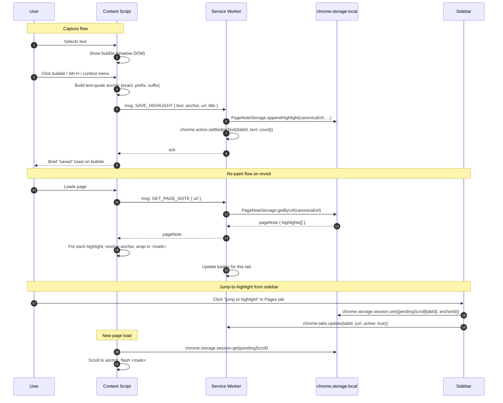

# feat: Highlight Capture (Save.day-style) for Offline Notes

## Overview

Add the ability to highlight text on any web page and save it into Offline Notes. Each unique URL gets one auto-created "page note" that accumulates highlights. On revisit, previously-saved highlights are re-painted in place on the page. The capture trigger is wired to three surfaces (a floating bubble next to the selection, a right-click context menu entry, and a new keyboard shortcut). The sidebar gains a separate "Pages" tab that lists page notes by most-recently-highlighted, with per-highlight actions (jump-to-page, copy-as-quote, delete).

Today the extension is a closed-loop notebook with no awareness of the open web. This change converts it into a web-aware capture tool while keeping the offline-only, local-storage-only character intact (no network calls, no cloud).

## Problem Frame

See origin: [`docs/brainstorms/2026-04-15-highlight-capture-requirements.md`](../brainstorms/2026-04-15-highlight-capture-requirements.md). The headline differentiator is the in-page re-paint on revisit, which is what separates this from "yet another web clipper."

## Requirements Trace

Carried verbatim from the origin document. The plan must satisfy all of:

- **R1–R5** Capture: bubble, context menu, shortcut, schema (`text`, `sourceUrl`, `pageTitle`, `capturedAt`), in-page confirmation
- **R6–R8** Storage: one auto page note per canonical URL, distinct entity from manual notes, canonicalization rules deferred
- **R9–R11** Re-paint: visual re-paint on revisit, best-effort matching with silent skip on miss, broad host access accepted
- **R12–R14** Sidebar: separate "Pages" tab, page-note detail with per-highlight actions, per-tab badge
- **R15–R16** Privacy: skip `chrome://`/`chrome-extension://`/`file://`, no network calls

## Scope Boundaries

Carried from origin:

- Not a full annotation tool: no per-highlight comments, no colour choice, no shared/multi-user
- No image, PDF, or iframe capture
- Re-paint is best-effort only — no fuzzy semantic matching, no SPA route-change detection beyond the page-load lifecycle
- Pages tab does not retroactively merge if canonicalization rules change

### Deferred to Separate Tasks

- **Aesthetic / UX refresh of the bubble, badge, Pages tab, popup, and sidebar as one visual system** — separate brainstorm + plan. This plan ships the bubble and Pages tab in functional but unstyled-beyond-defaults form; the design pass replaces the surfaces in a follow-up PR. The bubble's CSS file (Unit 4) is intentionally minimal so it can be replaced wholesale without churning the capture logic.

## Context & Research

### Relevant Code and Patterns

- **`manifest.json`** — current permissions are `storage`, `sidePanel`, `tabs`. Existing `commands` block has two entries (`quick-note`, `open-sidebar`); a third (`save-highlight`) will be added. No `content_scripts` block today.
- **`lib/storage.js`** — `StorageManager` class wraps `chrome.storage.local` under key `offline_notes`. The new `PageNoteStorage` mirrors its shape (constructor with key, async CRUD methods, `try/catch` + `console.error` style) but operates on a sibling key `offline_page_notes`.
- **`background/background.js`** — minimal service worker that only routes `chrome.commands.onCommand` and opens the side panel on install. Will absorb the context-menu registration, message router, and badge management.
- **`sidebar/sidebar.js`** + **`sidebar/sidebar.html`** + **`sidebar/sidebar.css`** — the Pages tab grafts onto this surface. Existing tab/list patterns (none yet, the sidebar is one flat view) need a small tab strip primitive.
- **`lib/templates.js`** — convention for HTML-string templates with `escapeHtml()` discipline. Apply the same discipline anywhere the content script injects HTML (bubble, mark wrappers).
- **`lib/html2canvas.min.js`** — precedent for the "vendor third-party JS into `lib/` for offline operation" pattern. The DOM anchor logic in this plan is hand-rolled, not vendored.

### Institutional Learnings

- The extension's CHANGELOG explicitly fixed a v1.0.3 bug where html2canvas was loaded from a CDN and broke offline use. The same posture applies here: any new dependency must be vendored, and the content script must not pull anything from a CDN.

### External References

- W3C Web Annotation Data Model — text-quote selectors (the `{exact, prefix, suffix}` shape this plan uses for anchors).
- Chrome MV3 docs: `chrome.scripting`, `chrome.contextMenus`, `chrome.action.setBadgeText` (per-tab `tabId` argument), `chrome.storage.session` (MV3-only ephemeral storage).

## Key Technical Decisions

- **Permissions added**: `scripting`, `contextMenus`, `host_permissions: ["<all_urls>"]`. **Rationale:** re-paint on load runs without user gesture, ruling out `activeTab`. Install-time warning is an accepted cost (see origin R11).
- **DOM anchor = text-quote `{exact, prefix, suffix}`** with ~32-char prefix/suffix windows, hand-rolled, no library. **Rationale:** simple, well-understood algorithm; resilient enough for static articles which is the realistic target use case; consistent with the "vendor only what's necessary" posture (`lib/html2canvas.min.js` is the only current vendored dep).
- **URL canonicalization**: lowercase host, strip hash, drop tracking params (`utm_*`, `fbclid`, `gclid`, `mc_*`, `_hsenc`, `_hsmi`, `igshid`, `ref_`), normalize trailing slash on path. **Rationale:** covers the 80% case (utm-tagged links from emails/social are the most common cause of accidental page-note forking); deeper rules can be added on report.
- **Storage layout**: sibling key `offline_page_notes` + new `PageNoteStorage` class in `lib/page-storage.js`. **Rationale:** zero migration impact on existing users (no existing page notes), no risk of contaminating the manual-notes list, the two domains can evolve independently.
- **Bubble = Shadow DOM**. **Rationale:** isolates bubble styles from arbitrary host page CSS (which would otherwise routinely break the bubble's appearance). One container element appended to `<body>`, all bubble markup lives inside its shadow root.
- **Badge management** via `chrome.tabs.onUpdated` (`status === 'complete'` filter) plus `chrome.tabs.onActivated`. **Rationale:** no extra permissions beyond existing `tabs`; sufficient granularity since highlights only change on explicit save.
- **Jump-to-highlight roundtrip** via `chrome.storage.session`. **Rationale:** MV3-only, ephemeral (cleared on browser restart), perfect for "after the next page load on tab N, scroll to anchor X."
- **Incognito** = opt-out by default (no `incognito: "spanning"` declaration in manifest). **Rationale:** matches user expectations for a privacy-first local-storage extension; user can opt in via `chrome://extensions` per-extension toggle if desired.
- **Excluded URL schemes** enforced two ways: `matches: ["http://*/*", "https://*/*"]` in the `content_scripts` declaration, plus an early-return guard in the content script for defence-in-depth.

## Open Questions

### Resolved During Planning

- *URL canonicalization rules*: see Key Decisions. Default rule set above; iterate on report.
- *DOM anchor strategy*: hand-rolled text-quote, no library.
- *Per-tab badge mechanism*: `chrome.tabs.onUpdated` + `onActivated`, no extra permissions.
- *Incognito*: opt-out default.
- *Storage layout*: `offline_page_notes` key + new `PageNoteStorage` class.
- *Jump-to-highlight roundtrip*: `chrome.storage.session` pending-scroll record keyed by tabId, consumed by content script on next load.

### Deferred to Implementation

- *Anchor matching tolerance details* (case-sensitivity, whitespace-collapse, how aggressively to fuzz when prefix/suffix don't match exactly): tune against real pages during Unit 5; pick the simplest behavior that passes the test scenarios listed there.
- *Bubble dismissal edge cases* (does selection inside the bubble itself dismiss it? what about right-click on the bubble?): resolve by manual testing in Unit 4.
- *Maximum highlight length cap*: requirement R4 says "no truncation," but a sanity ceiling (e.g. 100 KB per highlight to prevent storage exhaustion from accidental "select all" on a long page) may be necessary; decide during Unit 2 storage tests.
- *Behaviour when storage write fails* (quota exceeded): currently `StorageManager` swallows errors with `console.error`; mirror that for now and revisit only if reports surface.

## High-Level Technical Design

> *This illustrates the intended approach and is directional guidance for review, not implementation specification. The implementing agent should treat it as context, not code to reproduce.*



Anchor shape (data only, not a method signature):

```
Highlight {
  id: string                  // local UUID
  text: string                // selected text, verbatim
  anchor: {
    exact: string             // == text
    prefix: string            // ~32 chars before selection in textContent
    suffix: string            // ~32 chars after selection in textContent
  }
  capturedAt: ISO8601 string
}

PageNote {
  id: string                  // canonical URL hash, deterministic
  url: string                 // canonical URL
  pageTitle: string           // user-editable, defaults to capture-time title
  highlights: Highlight[]     // ordered by capturedAt
  createdAt, updatedAt: ISO8601
}
```

## Implementation Units

- [ ] **Unit 1: Manifest, permissions, command, and web-accessible resources**

**Goal:** Wire up all the manifest-level prerequisites in one atomic change so subsequent units have the runtime surface they need.

**Requirements:** R1, R2, R3, R9, R11, R15

**Dependencies:** None.

**Files:**
- Modify: `manifest.json`

**Approach:**
- Add `"scripting"` and `"contextMenus"` to `permissions`.
- Add `"host_permissions": ["<all_urls>"]`.
- Add a `"content_scripts"` block: `matches: ["http://*/*", "https://*/*"]`, `js: ["lib/anchor.js", "content/highlight.js"]`, `css: ["content/highlight.css"]`, `run_at: "document_idle"`, `all_frames: false`.
- Add a third entry to the existing `commands` block: `"save-highlight"` with suggested key `Alt+H` (mac and default).
- Bump `version` to `1.1.0` (minor — new feature, backwards-compatible storage).

**Patterns to follow:**
- The existing `commands` block in `manifest.json` for the new `save-highlight` entry.

**Test scenarios:**
- *Test expectation: none* — manifest is pure declaration. Unit 6 verifies the command shortcut fires; Unit 4 verifies the content script is injected on `http(s)` and not on `chrome://`.

**Verification:**
- Loading the unpacked extension does not produce any manifest-validation errors in `chrome://extensions`.
- Install warning shows the broad host-access prompt (expected per R11).

---

- [ ] **Unit 2: Page-note storage layer**

**Goal:** Provide a `PageNoteStorage` class that owns the `offline_page_notes` storage key, including URL canonicalization and append-highlight semantics.

**Requirements:** R4, R6, R7, R8, R16

**Dependencies:** None (parallel-safe with Unit 1).

**Files:**
- Create: `lib/page-storage.js`
- Create: `lib/url-canonical.js`
- Create: `test-page-storage.html` (manual harness, mirrors `test-image-generation.html` style)

**Approach:**
- `lib/url-canonical.js` exports a single function `canonicalizeUrl(rawUrl)` returning the canonical string. Lowercase host, drop hash, drop tracking params (allowlist of stripped params per Key Decisions), normalize trailing slash on path. Pure function, no side effects.
- `lib/page-storage.js` defines `PageNoteStorage` class on the global scope (matches the `StorageManager` pattern — no ES modules in popup/sidebar).
- Methods: `getByUrl(url)`, `getById(id)`, `getAll()`, `appendHighlight(url, pageTitle, highlight)` (creates page note if absent; appends if present, updates `updatedAt` and `pageTitle` only if currently empty), `deleteHighlight(pageNoteId, highlightId)`, `deletePageNote(pageNoteId)`, `updatePageTitle(pageNoteId, newTitle)`.
- `id` for a page note is a deterministic hash of the canonical URL (e.g. SHA-256 hex truncated to 16 chars via `crypto.subtle.digest`) so the same URL always produces the same id without a lookup.
- `id` for a highlight is `crypto.randomUUID()`.
- Error handling mirrors `StorageManager`: `try/catch` + `console.error` + return safe defaults (empty array / null).

**Patterns to follow:**
- `lib/storage.js` `StorageManager` constructor and method shape.

**Test scenarios:**
- *Happy path*: `appendHighlight` on a never-seen URL creates a page note with one highlight; the page note's `id` matches `getByUrl(sameUrl).id`.
- *Happy path*: `appendHighlight` on a known URL appends to the existing note; total highlights count increases by 1; `updatedAt` advances.
- *Edge case*: two URLs that differ only in `?utm_source=...` produce the same canonical id and share a page note.
- *Edge case*: two URLs that differ only in `#section` fragment produce the same canonical id.
- *Edge case*: URLs that differ only in trailing slash produce the same canonical id.
- *Edge case*: URLs that differ in a non-tracking query param (e.g. `?id=42` vs `?id=43`) produce **different** canonical ids.
- *Happy path*: `deleteHighlight` removes one highlight and leaves siblings intact; `deletePageNote` removes the entire entry.
- *Edge case*: `getByUrl` for an unknown URL returns `null` without throwing.
- *Edge case*: `appendHighlight` of a 100 KB-string highlight succeeds (sanity ceiling decision per Deferred to Implementation).
- *Error path*: simulated `chrome.storage.local.set` failure logs to console and the in-memory call resolves without throwing.

**Verification:**
- All test-harness scenarios pass when `test-page-storage.html` is opened in the loaded extension.
- `chrome.storage.local` inspection in DevTools shows the `offline_page_notes` key shape matches the documented schema.

---

- [ ] **Unit 3: Text-quote DOM anchor library**

**Goal:** A pure-function module that serializes a current `Selection`/`Range` into an anchor and resolves an anchor back to a `Range` on a later page load.

**Requirements:** R9, R10

**Dependencies:** None (parallel-safe with Units 1–2).

**Files:**
- Create: `lib/anchor.js`
- Create: `test-anchor.html` (manual harness with fixture HTML and assertions)

**Approach:**
- `serializeAnchor(range)` returns `{exact, prefix, suffix}`. Walks the document's textContent in DOM order; finds the selection's text offsets; takes up to 32 characters of context before and after.
- `resolveAnchor(anchor, root)` returns a `Range` or `null`. Strategy: collect all text nodes in `root`, build a flat string with a parallel offset map (text node + local offset for each character), find candidate `exact` matches in the flat string, score each candidate by how well its surrounding context matches `prefix` and `suffix` (longest-common-prefix from the right edge for prefix; from the left edge for suffix), pick the highest-scoring candidate above a threshold; return null if no candidate scores above threshold.
- Whitespace handling: collapse runs of whitespace to single spaces in both stored anchor and live DOM scan to survive minor reflow / formatting differences. Document this in a single short comment at the top of the file (the WHY: page formatting often differs slightly between visits).
- No DOM mutation in this module; the caller (Unit 5) handles wrapping.

**Patterns to follow:**
- The "manual HTML test harness" pattern from `test-image-generation.html` and `test-templates.html`.

**Test scenarios:**
- *Happy path*: serialize a selection in a static fixture, resolve it on the same fixture, get back a Range covering the same text.
- *Happy path*: serialize a selection on the word "the" inside a paragraph that has multiple "the" instances; resolution picks the one whose prefix/suffix matches.
- *Edge case*: selection at the very start of a document (empty prefix) resolves correctly.
- *Edge case*: selection at the very end of a document (empty suffix) resolves correctly.
- *Edge case*: selection spans across multiple text nodes (e.g. text wrapped around a `<strong>` tag) serializes to the unstyled text; resolves and returns a Range that selects the same visible text.
- *Edge case*: target text appears 3 times with identical surrounding 5 chars but different at 30 chars → correct candidate is picked because prefix/suffix windows are large enough.
- *Error path*: anchor whose `exact` no longer appears in the document at all → returns `null`.
- *Error path*: anchor whose `exact` appears but no candidate has matching prefix/suffix above threshold → returns `null` (silent miss per R10).
- *Edge case*: page content has changed: extra whitespace inserted between words around the selection → still resolves (whitespace-collapse).
- *Edge case*: selection text contains punctuation/quotes/emoji → serializes and resolves byte-for-byte.

**Verification:**
- All test-harness scenarios pass.
- A second harness `test-anchor.html` includes a "load real article" button (paste an article into a textarea, render to fixture) so the implementer can sanity-check on real content.

---

- [ ] **Unit 4: Content script — capture (bubble, message dispatch, in-page confirmation)**

**Goal:** Inject the in-page selection bubble, handle the three capture triggers (bubble click, context menu via background, keyboard shortcut via background), serialize the anchor, and dispatch the save message to the service worker.

**Requirements:** R1, R2, R3, R4, R5, R15

**Dependencies:** Unit 1 (manifest), Unit 3 (`lib/anchor.js`).

**Files:**
- Create: `content/highlight.js`
- Create: `content/highlight.css`

**Approach:**
- Early-return guard: if `location.protocol` is not `http:` or `https:`, exit.
- On `selectionchange` (debounced ~100 ms): if selection is non-empty and within visible viewport, position the bubble next to the selection's bounding rect; otherwise hide.
- Bubble = a single host element (`<offline-notes-bubble>` — custom tag name avoids collisions) attached to `<body>`, with a Shadow DOM root containing the button markup and styles from `content/highlight.css` (CSS file is read as text and injected as `<style>` inside the shadow root, since extensions can't `link` external CSS into a shadow root from a content script easily).
- On bubble click: capture the current `Selection.getRangeAt(0)`, call `serializeAnchor(range)`, send `chrome.runtime.sendMessage({type: 'SAVE_HIGHLIGHT', payload: {text, anchor, url: location.href, pageTitle: document.title}})`. On ack, briefly swap the bubble label to a "Saved" affordance for ~1 s, then hide.
- Listen for `chrome.runtime.onMessage` of type `CAPTURE_FROM_SHORTCUT` and `CAPTURE_FROM_CONTEXT_MENU` (sent by the service worker — see Unit 6) and run the same capture path. The context-menu version receives the selected text from `chrome.contextMenus.OnClickData.selectionText` and re-derives the range from `window.getSelection()` if still present, falling back to a synthesized text-only anchor (no prefix/suffix) when selection is gone (rare race).
- All HTML written into the shadow root must go through an `escapeHtml` helper inlined at the top of the file (mirrors `lib/templates.js` discipline).
- `content/highlight.css` is intentionally minimal — placeholder pill button. Comment at top: `/* Visual identity is owned by the upcoming aesthetic pass. Keep this file replaceable. */`

**Patterns to follow:**
- `lib/templates.js` `escapeHtml` discipline for any HTML interpolation.
- `lib/storage.js` `try/catch` + `console.error` posture for failures.

**Test scenarios:**
- *Happy path*: select text on a fixture page, bubble appears within 200 ms positioned within the selection's bounding rect; click → message dispatched, bubble shows "Saved" briefly, then hides.
- *Happy path*: select text, press `Alt+H`, save fires without bubble click.
- *Happy path*: right-click selection, choose "Save highlight to Offline Notes" → save fires.
- *Edge case*: deselect (click elsewhere) → bubble disappears within debounce window.
- *Edge case*: rapidly change selection → bubble repositions, no flicker, no orphaned bubble nodes left in DOM.
- *Edge case*: selection scrolls off-screen (user scrolled away) → bubble does not reappear at last position; reappears in correct place when scrolled back.
- *Edge case*: page is `chrome://extensions` (script does not run anyway because of `matches`) → no errors.
- *Edge case*: page is `https://example.com/file.pdf` rendered as PDF (Chrome's built-in viewer) → script injection fails silently or selection is unavailable; no exceptions in console.
- *Integration*: page CSS sets `* { all: revert !important; }` at the body level → bubble visual is unaffected because of Shadow DOM isolation.
- *Error path*: `chrome.runtime.sendMessage` returns no listener → caught, logged, bubble shows transient "Failed" affordance.

**Verification:**
- Manual smoke on three real sites of varying CSS aggression (e.g. a Medium article, a GitHub issue page, a heavily-styled marketing landing page): bubble looks consistent, all three triggers save successfully.

---

- [ ] **Unit 5: Content script — re-paint on revisit + scroll-to-highlight handoff**

**Goal:** On page load, fetch the page note for the current canonical URL, resolve each highlight's anchor, and wrap matched ranges in `<mark class="offline-notes-highlight">`. Also consume any pending-scroll record from `chrome.storage.session` and scroll/flash the relevant mark.

**Requirements:** R9, R10, R12 (jump-to-highlight half)

**Dependencies:** Units 1, 2, 3, 4.

**Files:**
- Modify: `content/highlight.js` (add the re-paint + scroll-flash code paths to the existing file)
- Modify: `content/highlight.css` (add `mark.offline-notes-highlight` styles — yellow background, no other change; flash animation via CSS keyframes)

**Approach:**
- On `document_idle` (the existing run-time): send `chrome.runtime.sendMessage({type: 'GET_PAGE_NOTE', url: location.href})` to the service worker, which canonicalizes and returns the page note (or null).
- For each highlight: call `resolveAnchor(highlight.anchor, document.body)`. If non-null, wrap the resolved Range in a `<mark class="offline-notes-highlight" data-highlight-id="...">`. Skip silently on null.
- Range wrapping must handle ranges that span multiple text nodes by splitting at boundaries (use `Range.surroundContents` where the range fits inside one text node; otherwise walk the range and wrap each text node fragment).
- Idempotency: if a `<mark[data-highlight-id="..."]>` already exists for this id, skip (handles SPA cases where the script re-runs without a full reload — best-effort, not guaranteed).
- After re-paint, check `chrome.storage.session.get('pendingScroll')`. If a record exists for `{tabId: <this tab>, highlightId: <id>}`, find the matching `<mark>`, `scrollIntoView({block: 'center'})`, add a `.offline-notes-flash` class for ~1.5 s, then clear the record from `chrome.storage.session`.
- This unit obtains the current `tabId` by asking the service worker (content scripts cannot read it directly), wrapped in the existing message channel.

**Patterns to follow:**
- The bubble's Shadow DOM isolation does NOT extend here — `<mark>` tags must live in the host page's DOM so they actually highlight content. Use a single distinctive class name (`offline-notes-highlight`) and accept that some pages may override it; document this trade-off in a single-line comment.

**Test scenarios:**
- *Happy path*: reload a page that has 3 saved highlights (all anchors still valid) → all 3 are visually marked yellow.
- *Happy path*: pending-scroll record is set for one of the marks → page scrolls to it and it flashes.
- *Edge case*: page has 5 saved highlights, 2 of which no longer match → other 3 are marked, 2 are silently skipped, no console errors.
- *Edge case*: anchor resolves to a Range that spans across an `<a>` tag → wrapping splits at boundaries and produces two `<mark>` siblings with the same `data-highlight-id`; both get the highlight style.
- *Edge case*: no page note exists for this URL → no DOM mutation, no badge, no errors.
- *Edge case*: the same content script re-runs (e.g. SPA) → existing marks are not double-wrapped.
- *Integration*: capture a highlight, navigate away, come back via `history.back()` → in browsers that fire `pageshow` from cache, marks should still be present (test and document if not — accept as a known limitation per R10).
- *Error path*: `chrome.storage.session.get` rejects → caught, logged, no scroll attempted.

**Verification:**
- On a real article: capture two highlights, refresh the page, both highlights re-appear.
- After "jump to highlight" from the sidebar: the page opens, scrolls to the right mark, and the mark visibly flashes.

---

- [ ] **Unit 6: Service worker — context menu, command, message router, badge**

**Goal:** The service worker becomes the single coordinator: it owns the context-menu entry, listens for the `save-highlight` command, routes capture messages from any of the three triggers to `PageNoteStorage`, fetches page notes for the content script's re-paint request, and updates the per-tab badge.

**Requirements:** R2, R3, R6, R14, R15

**Dependencies:** Units 1, 2.

**Files:**
- Modify: `background/background.js`

**Approach:**
- On `chrome.runtime.onInstalled`: register `chrome.contextMenus.create({id: 'save-highlight', title: 'Save highlight to Offline Notes', contexts: ['selection']})`.
- On `chrome.contextMenus.onClicked` for `save-highlight`: send `chrome.tabs.sendMessage(tab.id, {type: 'CAPTURE_FROM_CONTEXT_MENU', selectionText: info.selectionText})` to delegate the actual capture to the content script (which has access to the live `Range`).
- Extend `chrome.commands.onCommand` to handle `save-highlight`: query the active tab and send `chrome.tabs.sendMessage(tab.id, {type: 'CAPTURE_FROM_SHORTCUT'})`.
- Add `chrome.runtime.onMessage` handlers:
  - `SAVE_HIGHLIGHT` → instantiate `PageNoteStorage`, call `appendHighlight(url, pageTitle, {id: crypto.randomUUID(), text, anchor, capturedAt})`. After save, call `updateBadge(sender.tab.id, canonicalUrl)`.
  - `GET_PAGE_NOTE` → return the page note for the canonicalized URL (or null).
  - `GET_TAB_ID` → return `sender.tab.id`.
- `updateBadge(tabId, canonicalUrl)`: count highlights for the URL, call `chrome.action.setBadgeText({tabId, text: count > 0 ? String(count) : ''})` and `chrome.action.setBadgeBackgroundColor({tabId, color: '#FFC107'})`.
- Listen on `chrome.tabs.onUpdated` (filter `status === 'complete'`) and `chrome.tabs.onActivated` to refresh the badge for the now-current URL of the relevant tab.
- The service worker imports `lib/url-canonical.js` and `lib/page-storage.js` via `importScripts` (allowed in MV3 service workers when `"type"` is omitted — note: the manifest currently declares `"type": "module"` for the background; either flip to classic and use `importScripts`, or keep module and use `import` statements with the lib files exporting properly. Decision: keep `"type": "module"` and convert `lib/url-canonical.js` and `lib/page-storage.js` to also be loadable as ES modules in the service-worker context while remaining usable by the popup/sidebar via their existing `<script>` tags — concretely, the file ends with `if (typeof module !== 'undefined') { ... }` style guard, but for the service worker prefer dynamic `import('../lib/page-storage.js')` and re-export. Validate this dual-loading pattern works during implementation; if it gets ugly, fall back to making the service worker `"type": "classic"` and using `importScripts`.)

**Patterns to follow:**
- The existing `chrome.commands.onCommand` switch in `background/background.js`.

**Test scenarios:**
- *Happy path*: content script sends `SAVE_HIGHLIGHT` → `PageNoteStorage` write succeeds, badge updates to "1" on the originating tab.
- *Happy path*: context-menu click on selected text → message arrives at content script, capture proceeds normally.
- *Happy path*: `Alt+H` with text selected → message arrives at content script, capture proceeds.
- *Edge case*: `Alt+H` with no text selected → content script no-ops gracefully (covered in Unit 4 tests; here verify the message dispatches without service-worker error).
- *Edge case*: navigating tab from URL with 3 highlights to URL with 0 highlights → badge clears.
- *Edge case*: switching tabs (`onActivated`) between two tabs with different highlight counts → badge updates to reflect the now-active tab.
- *Edge case*: `GET_PAGE_NOTE` for a URL with no page note → returns `null`, content script handles gracefully.
- *Error path*: `appendHighlight` throws → service worker catches, logs, sends `{ok: false}` to content script.
- *Integration*: capture via shortcut, then via context menu, then via bubble — all three increment the same page note's highlight count.

**Verification:**
- Watching the extension's service-worker DevTools console shows clean message flow with no unhandled promise rejections.
- Badge updates correctly across navigation and tab switching on a manual smoke session.

---

- [ ] **Unit 7: Sidebar — Pages tab, page-note detail, per-highlight actions**

**Goal:** Add a "Pages" tab to the sidebar that lists page notes by most-recently-highlighted, with a detail view showing each highlight and per-highlight actions (jump-to-page, copy-as-quote, delete page note, delete individual highlight, edit page title).

**Requirements:** R12, R13

**Dependencies:** Unit 2.

**Files:**
- Modify: `sidebar/sidebar.html`
- Modify: `sidebar/sidebar.js`
- Modify: `sidebar/sidebar.css`

**Approach:**
- Top of the sidebar gains a tab strip: `[Notes] [Pages]`. Clicking switches the visible panel; persist the active tab in `chrome.storage.local` under `offline_notes_settings.activeSidebarTab`.
- Notes panel is the existing UI, untouched.
- Pages panel: list view shows page notes sorted by `updatedAt` desc. Each row: page title (with host as subtitle), highlight count, last-capture relative time. Click → detail.
- Detail view: editable page title (inline), source URL with copy-link affordance, ordered list of highlights (each shows text, capture timestamp, action buttons: copy-as-markdown-quote, jump-to-highlight, delete). Footer: "Delete entire page note" with confirm.
- Copy-as-markdown-quote: produces `> {text}\n>\n> — [{pageTitle}]({url})` and writes to clipboard via `navigator.clipboard.writeText`.
- Jump-to-highlight: opens (or focuses) a tab with the page note's URL, then writes a pending-scroll record to `chrome.storage.session` keyed by the new tab's id. Pseudo-flow:
  - Find existing tab with that URL (`chrome.tabs.query`); if found, focus it and update; otherwise `chrome.tabs.create`.
  - On the resulting tabId, set `chrome.storage.session.set({pendingScroll: {tabId, highlightId}})` *before* the page finishes loading. Acceptable race: the content script reads the record on `document_idle`; if the page was already loaded, send an additional `chrome.tabs.sendMessage(tabId, {type: 'SCROLL_TO_HIGHLIGHT', highlightId})` as a faster path.
- All HTML built from page-note data uses an `escapeHtml` helper (mirror `lib/templates.js`).
- Visual styling is intentionally minimal — same comment in CSS as Unit 4.

**Patterns to follow:**
- Existing `sidebar/sidebar.js` event-binding and rendering patterns.
- `lib/markdown.js` for the copy-as-quote serialization helper if it can be extended; otherwise a small inline function in `sidebar.js`.

**Test scenarios:**
- *Happy path*: Pages tab with three page notes renders three rows in `updatedAt` order; clicking the most recent opens its detail view.
- *Happy path*: editing the page title inline persists via `PageNoteStorage.updatePageTitle`; reloading the sidebar shows the new title.
- *Happy path*: copy-as-quote writes the expected markdown to the clipboard.
- *Happy path*: delete a single highlight removes it from the list and from storage; deleting the last highlight does NOT auto-delete the page note (user choice).
- *Happy path*: delete the page note removes it from the list; reloading the sidebar confirms persistence.
- *Edge case*: Pages tab with zero page notes renders an empty state ("No saved highlights yet — try selecting text on a page and clicking the bubble.").
- *Edge case*: page note with one highlight where the URL is unreachable (e.g. localhost) → jump-to-highlight still opens a new tab; page-load failure is the browser's responsibility.
- *Integration (jump round-trip)*: from sidebar, click jump on highlight X for URL Y → a tab opens at Y, the content script picks up the pending-scroll record, scrolls and flashes mark X. Verifies the Unit 5 + Unit 7 boundary.
- *Edge case*: switching between Notes and Pages tabs preserves the active tab across sidebar reopens.
- *Error path*: `navigator.clipboard.writeText` throws (e.g. permission denied) → toast a "Copy failed" message inline.

**Verification:**
- Manual smoke: capture three highlights on three different sites, open the Pages tab, jump to one, edit a title, delete one highlight, copy-as-quote, delete a page note. All actions land correctly and persist across sidebar reopen.

---

- [ ] **Unit 8: End-to-end manual verification + CHANGELOG update**

**Goal:** Run a full end-to-end smoke against the success criteria from the origin doc, fix anything that surfaces, update CHANGELOG and README.

**Requirements:** All success criteria from the origin document.

**Dependencies:** Units 1–7.

**Files:**
- Modify: `CHANGELOG.md`
- Modify: `README.md` (add a "Highlight capture" section under Features; update Permissions list)
- Modify: `manifest.json` (final version bump confirmation)

**Approach:**
- Run the origin doc's primary success scenario verbatim: browse to an article, highlight three sentences from different paragraphs, close the tab, reopen the URL, verify all three are re-painted on the page and listed in the Pages tab.
- Sanity-check the existing manual-notes workflow is unchanged (popup save, sidebar Notes tab, image generation, markdown export).
- Verify the install-time permission warning surfaces (load unpacked into a clean Chrome profile).
- Update CHANGELOG with v1.1.0 entry capturing: highlight capture (bubble + context menu + Alt+H), Pages tab, per-page badge, broad host access permission added.
- Update README's Features and Permissions sections.

**Test scenarios:**
- *Test expectation: none — verification unit only.* All test scenarios for behavior live in Units 2, 3, 4, 5, 6, 7.

**Verification:**
- Origin doc's primary success scenario passes end to end on at least 3 distinct sites.
- README accurately describes new behavior.
- CHANGELOG entry merged.

## System-Wide Impact

- **Interaction graph:** New surfaces — content script (every `http(s)` page), context menu (selection context), command shortcut (`Alt+H`), service-worker message router, sidebar Pages tab. Existing popup, manual-notes sidebar, image generation, markdown export are untouched.
- **Error propagation:** Storage failures bubble through the existing `try/catch` + `console.error` pattern used by `StorageManager`. Anchor-resolve failures are silent by design (R10). `chrome.runtime.sendMessage` failures are caught at the content-script call site and surfaced as a transient bubble affordance.
- **State lifecycle risks:** Per-tab badge state is not persisted across browser restarts (it's keyed to live tab ids, which are recycled); badge re-derives on first `tabs.onUpdated`/`onActivated`. `chrome.storage.session` records are auto-cleared on browser restart, which means a queued "jump to highlight" that bridges a restart will silently fail (acceptable).
- **API surface parity:** No change to `StorageManager` (manual-notes storage). Page-note storage is a strictly additive sibling. Manual notes never appear in the Pages tab and vice versa.
- **Integration coverage:** The capture-then-re-paint round-trip and the sidebar-jump-then-scroll round-trip are not provable by unit tests of any single file; both must be exercised in Unit 8's end-to-end smoke.
- **Unchanged invariants:** `lib/storage.js` `StorageManager` API and `offline_notes` storage shape are unchanged. `manifest.json` `commands` block continues to support both existing shortcuts. The popup and the existing sidebar Notes view render identically to v1.0.3 on a profile with no page notes.

## Risks & Dependencies

| Risk | Mitigation |
|------|------------|
| Broad host-access install warning ("Read and change all your data on websites you visit") deters users on first install. | Accepted in origin R11. Mitigation: add a one-line explanation in the README and in the CHANGELOG so curious users can verify the local-only posture in code (no `fetch` calls anywhere). |
| Hand-rolled DOM anchor's match rate is worse than expected on dynamic / JavaScript-rendered pages, leading to many silently-skipped highlights and a "looks broken" feel. | Match strategy is intentionally simple in v1.1.0; if reports of poor recall appear, swap in a vendored library (`dom-anchor-text-quote` or similar) without changing the stored anchor schema. The schema is forward-compatible with richer matchers because it only stores text + context. |
| Bubble visual quality is poor before the aesthetic pass and embarrasses the extension. | Ship behind the same release as the aesthetic pass if the cosmetic gap is too large at code-complete; otherwise document the unstyled state in the CHANGELOG entry as "v1.1.0-functional, v1.2.0-styled." Decision is the user's call at code-complete. |
| Service-worker module-vs-classic loading turns out to be awkward when `lib/page-storage.js` needs to be loadable by both popup `<script>` tags and the SW (Unit 6 approach). | If the dual-loading pattern is ugly during implementation, fall back to `"type": "classic"` for the service worker and use `importScripts`. Documented as a deferred-to-implementation question in Unit 6. |
| Writing into the host page's DOM with `<mark>` could break sites with strict layout (e.g. CSS Grid with auto-placement). | Use `<mark>` (semantic, browser-default styling) with a single class. Accept rare visual regressions on hostile pages — this is consistent with all annotation extensions including Save.day. |
| `chrome.storage.local` quota exhaustion if a user accumulates thousands of highlights, especially with large `prefix`/`suffix` windows. | Sanity-cap individual highlight text at 100 KB (Unit 2 deferred decision). Document the per-extension storage ceiling (~10 MB) in CHANGELOG. Future PR can add a "storage usage" indicator in the Pages tab if demand surfaces. |

## Documentation / Operational Notes

- **CHANGELOG**: v1.1.0 entry — "Added: highlight capture from any web page (bubble, right-click, `Alt+H` shortcut), auto page notes per URL, in-page re-paint on revisit, Pages tab in sidebar, per-tab highlight count badge. Required new permissions: `scripting`, `contextMenus`, host access to all sites — local-only, no network calls."
- **README**: new "Highlight capture" subsection under Features; update Permissions list; document the install warning and why the broad host access is required (re-paint on load).
- **No telemetry, no rollout flag, no monitoring.** Local extension; instrumentation surface is `console.log` plus user reports.

## Sources & References

- **Origin document:** [`docs/brainstorms/2026-04-15-highlight-capture-requirements.md`](../brainstorms/2026-04-15-highlight-capture-requirements.md)
- Related code: `manifest.json`, `lib/storage.js`, `background/background.js`, `sidebar/sidebar.js`, `lib/templates.js`, `lib/html2canvas.min.js` (vendored-dependency precedent)
- External references: W3C Web Annotation Data Model (text-quote selectors); Chrome MV3 docs for `chrome.scripting`, `chrome.contextMenus`, `chrome.action.setBadgeText`, `chrome.storage.session`
