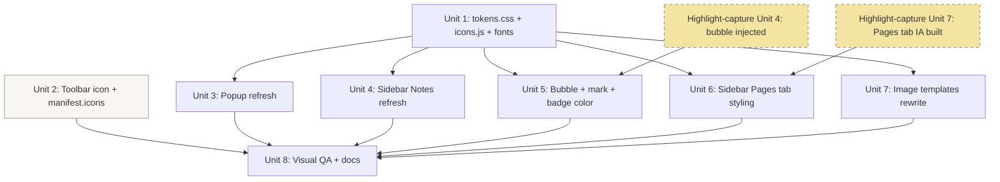

# feat: Warm-Paper Visual Identity Across All Surfaces

## Overview

Replace the extension's generic Bootstrap-ish chrome with a deliberate "warm paper / notebook" visual identity, applied consistently to every surface: design tokens, popup, sidebar (Notes + Pages tabs), in-page bubble, toolbar badge, toolbar icon, and the five image templates. Light theme only. No information-architecture changes — flows, fields, shortcuts, and save semantics are preserved. The single accent is sage green (`#7C9885`); the typeface is Inter Display (already vendored at `fonts/Inter_Display/`); the icon set is a small vendored subset of Lucide. The work slots into the existing codebase by introducing a tokens layer that every surface imports, then refreshing each surface against those tokens.

## Problem Frame

See origin: [`docs/brainstorms/2026-04-15-ux-warm-paper-requirements.md`](../brainstorms/2026-04-15-ux-warm-paper-requirements.md). The forcing function is the upcoming in-page bubble (from the sibling highlight-capture plan), which must look intentional on third-party web pages or it will read as adware. That decision pulls the whole extension toward needing a real visual identity, and warm-paper is the chosen direction.

## Requirements Trace

Carried verbatim from the origin document. Every requirement is satisfied by exactly one unit (cross-references noted):

- **R1–R6** Design tokens (palette, type, spacing, radii, shadow, icons) → Unit 1
- **R7–R9** Popup refresh → Unit 3
- **R10–R13** Sidebar Notes view refresh → Unit 4 (Pages-tab portion in Unit 6)
- **R14–R17** In-page bubble visual identity → Unit 5
- **R18** Toolbar icon redesign → Unit 2
- **R19** Per-tab badge color → Unit 5 (the badge call lives in the highlight-capture plan; this unit owns the color)
- **R20–R22** Image templates rewrite → Unit 7
- **R23–R24** Highlight `<mark>` style + flash animation → Unit 5
- **All success criteria** → Unit 8 (visual QA sweep)

## Scope Boundaries

Carried from origin:

- Light theme only. Dark mode deferred.
- No IA rework — popup fields, sidebar structure, keyboard shortcuts, save flows, and export options stay identical. Visual treatment only.
- No new functional features beyond what the highlight-capture plan already specifies.
- No new font dependencies (Inter Display is vendored and is the answer).
- No animation library; motion is CSS transitions on a small property set at consistent durations (120 ms micro, 1.5 s flash).
- Chrome Web Store listing assets (screenshots, store description) are not in scope — they ride on the same identity once it lands.

### Deferred to Separate Tasks

- **Settings UI** (would house a future dark-mode toggle, accent-color choice, etc.). No settings surface exists today; designing one is a separate brainstorm.
- **Onboarding / first-run experience.** Today the extension just opens the sidebar on install (`background/background.js`). A real onboarding flow is its own brainstorm.
- **Dark mode.** Light-only for v1 per the brainstorm decision. When added, the design tokens layer (Unit 1) is structured so a dark theme can drop in via a single `[data-theme="dark"]` block over the existing custom-property declarations.

## Context & Research

### Relevant Code and Patterns

- **`popup/popup.css`** — current chrome to be replaced. Uses inline color literals throughout (`#f8f9fa`, `#212529`, `#dee2e6`, `#667eea`); none of these survive. New CSS imports tokens at the top and references them via `var(--paper-50)` etc.
- **`sidebar/sidebar.css`** — same pattern, same replacement strategy. The Notes-view IA stays put; only colors, type, spacing, and radii change.
- **`lib/templates.js`** — `TemplateManager` class with `this.templates = { name: this.method.bind(this) }` registration. New `paper-*` templates plug into this map; the public API (`getTemplate`, `escapeHtml`, `truncateText`) is unchanged.
- **`fonts/Inter_Display/`** — six weights vendored (Thin, Light, Regular, Medium, SemiBold, Bold). The plan uses Regular (400), SemiBold (600), Bold (700). Other weights stay vendored but unused; pruning is a follow-up if size matters.
- **`lib/templates.js` `escapeHtml` discipline** — every interpolation of user content goes through it. Same discipline applies to any new HTML produced by Unit 5 (bubble) and Unit 6 (Pages tab) per the highlight-capture plan.
- **`images/icon.svg`** + **`images/create-placeholder-icons.html`** — current icon source plus a placeholder PNG generator. The new SVG replaces `images/icon.svg`; PNG generation can use the same utility or a fresh one.
- **`manifest.json`** — currently has no `icons` block (verified). Must be added in Unit 2 alongside the new icon assets.
- **`content/highlight.css`** (introduced by the sibling highlight-capture plan, Unit 4) — explicitly written as "placeholder, replaceable wholesale." Unit 5 of this plan replaces it.
- **`sidebar/sidebar.{html,js,css}` Pages-tab additions** (introduced by the sibling highlight-capture plan, Unit 7) — also written as "minimal styling, owned by the upcoming aesthetic pass." Unit 6 of this plan styles them.

### Institutional Learnings

- The CHANGELOG's v1.0.3 fix codifies the "no CDN dependencies" posture. This plan respects it: Inter Display is local, Lucide icons are vendored as inline SVG, no external font/icon network calls.
- The existing image templates already vendor inline styles (no external CSS) for html2canvas compatibility. The new paper-* templates inherit that constraint — they cannot rely on `lib/tokens.css` because html2canvas renders templates against an isolated container (Unit 7 expands on this).

### External References

- WCAG 2.1 contrast ratios for text and non-text content (the basis for splitting sage into sage-500 for ≥3 px elements and sage-700 for text use).
- Lucide icon set (MIT licensed, SVG source vendorable per icon).
- W3C Web Annotation Data Model already referenced by the sibling highlight-capture plan; relevant here only insofar as the `<mark>` styling (R23) lives in this plan.

## Key Technical Decisions

- **Tokens via CSS custom properties in `lib/tokens.css`**, imported at the top of every per-surface stylesheet via `@import`. **Rationale:** no build step in the project; CSS custom properties are universally supported in MV3 Chrome (>= last few major versions); single source of truth; trivially extensible to dark mode later via `[data-theme="dark"]` override block.
- **Sage split: `--sage-500` (`#7C9885`) for ≥3 px elements, `--sage-700` (`#5F7A6A`) for text on paper.** **Rationale:** brand sage at 14 px body fails WCAG AA contrast against `#FAF7F2` (~3.4:1). The darker stop passes (~6.0:1) without changing the brand impression at small text sizes; users perceive the brand color through buttons, focus rings, and icons (all of which stay at sage-500).
- **Type ramp: 12 / 14 / 16 / 20 px** with line-heights 1.4 / 1.5 / 1.5 / 1.3. Inter Display Regular (400) body, SemiBold (600) emphasis and headings, Bold (700) reserved for popup `h1` only. Tabular numerals (`font-feature-settings: "tnum"`) on metadata rows. **Rationale:** simple, four-step ramp; covers every text usage in the extension; tabular numerals stop timestamps from "dancing" on hover.
- **Spacing scale: 4 / 8 / 12 / 16 / 24 / 32 / 48 / 64 px** as `--space-1` through `--space-8`. **Rationale:** matches the 4 px grid from the brainstorm; consistent vocabulary across surfaces.
- **Radii: 4 px (`--radius-sm`) and 8 px (`--radius-md`) only.** No pill shapes, no large radii. **Rationale:** intentional "paper edges" vibe per origin R4.
- **Shadows: warm-tinted (`rgba(42, 38, 34, 0.08)`-ish), single soft layer.** Most surfaces have no shadow. **Rationale:** origin R5 — pure-black shadows break the warm palette.
- **Icons: vendored Lucide subset as inline SVG strings in `lib/icons.js`.** **Rationale:** no runtime fetch (offline posture); avoids vendoring 1000+ icons when ~10 are used; inline strings work inside the bubble's Shadow DOM and inside html2canvas template rendering.
- **Bubble styles use Shadow DOM scoping (already decided in highlight-capture plan)**. **Rationale:** isolates bubble appearance from arbitrary host page CSS. Tokens are inlined into the shadow root via the same CSS-text injection the highlight-capture plan uses.
- **Image templates do NOT consume `lib/tokens.css`.** Each template's HTML uses inline styles with literal token values (e.g. `background: #FAF7F2`) because html2canvas renders templates inside an isolated container and inherits poorly from external stylesheets. **Rationale:** match how the existing templates work. Token values are duplicated as CSS literals inside `lib/templates.js`. Acceptable: token values rarely change, and a comment at the top of `lib/templates.js` cross-references `lib/tokens.css` so future updates are co-located.
- **Toolbar icon = single SVG source + four PNG sizes.** **Rationale:** Chrome MV3 prefers PNG for the `icons` block; SVG kept as source-of-truth for future regeneration.
- **Empty-state illustrations: hand-drawn SVG, sage-stroke line art.** Three illustrations only (empty notes, empty pages, no search results). **Rationale:** lowest carrying cost; consistent with the line-icon vocabulary; avoids vendoring an illustration set.
- **Highlight `<mark>` color = `#F4E4A1` (cream-yellow), single value for v1.** **Rationale:** harmonizes with sage and cream paper, reads as "highlighter on aged paper." Dark-page legibility caveat documented as a known limitation; follow-up can add host-bg sampling if reports surface.
- **Motion durations: `--motion-fast: 120ms`, `--motion-slow: 1500ms`.** Two values only. Easing: `ease-out` for both. **Rationale:** consistent feel across surfaces with minimum decision surface.

## Open Questions

### Resolved During Planning

- *Palette stops*: paper-50/100/200/300, ink-700/900, sage-300/500/700, warm-grey-100/300/500. See Unit 1.
- *Type ramp*: 12/14/16/20 px with weights as above. See Unit 1.
- *Icon set*: Lucide vendored subset in `lib/icons.js`. See Unit 1.
- *Empty-state illustrations*: hand-drawn sage-stroke line art, three only. See Units 3 and 4.
- *Toolbar icon source-of-truth*: in-house SVG + PNG exports. See Unit 2.
- *Five template names + compositions*: defined per-template in Unit 7.
- *Highlight `<mark>` color*: `#F4E4A1`, single value. See Unit 5.
- *Sage contrast resolution*: split into sage-500 (≥3 px) and sage-700 (text). See Key Decisions.

### Deferred to Implementation

- *Exact warm-grey neutrals* (warm-grey-100/300/500): pick by sampling against real content during Unit 1. The brainstorm only commits to "warm-tinted greys, not pure cool greys."
- *Final shadow value*: `rgba(42, 38, 34, 0.08)` is a starting suggestion; tune for the bubble's actual host-page contrast in Unit 5.
- *Empty-state illustration compositions*: the visual content of each SVG (what an "empty notebook" looks like as a line drawing) is an implementation-time design call. The plan only commits to "one per empty state, sage-stroke, line-only."
- *Icon set final list*: the brainstorm estimates ~8–12 icons; the exact list emerges as each surface is implemented. Suggested starter set: notebook, search, plus, pencil, trash, copy, link, x-close, chevron-right, sparkle (for "Saved" affordance). Add or trim during implementation.
- *Font-loading FOUT mitigation*: `font-display: swap` is the default suggestion (no flash of invisible text); revisit only if the swap is visually jarring for the bold popup `h1`.
- *Whether to keep all six Inter Display weights vendored or prune to Regular/SemiBold/Bold*: defer until shipping; pruning saves ~120 KB but adds a maintenance step. Default is keep all six.

## Output Structure

Showing only new files / new directories. Modified files are listed per unit.

    lib/
    ├── tokens.css           # NEW — design tokens (Unit 1)
    └── icons.js             # NEW — vendored Lucide subset as inline SVG strings (Unit 1)
    images/
    ├── icon.svg             # MODIFIED — redesigned notebook glyph (Unit 2)
    ├── icon-16.png          # NEW — generated from SVG (Unit 2)
    ├── icon-32.png          # NEW
    ├── icon-48.png          # NEW
    ├── icon-128.png         # NEW
    └── empty-states/
        ├── notes-empty.svg  # NEW — line-drawing illustrations (Units 3, 4)
        ├── pages-empty.svg  # NEW
        └── search-empty.svg # NEW

## High-Level Technical Design

> *This illustrates how the tokens layer fans out to every surface, and which units depend on which other units (including dependencies on the sibling highlight-capture plan). It is directional guidance for review, not implementation specification.*

Sequencing implications:
- **Units 1, 2, 7 can land independently** of the highlight-capture plan — the toolbar icon (Unit 2) is the smallest and most visible first commit and a good signal-to-the-team that the work is in progress.
- **Units 3 and 4** can land as soon as Unit 1 is in place. They do not depend on highlight-capture.
- **Unit 5** requires highlight-capture Unit 4 to have landed (the bubble must exist to be styled).
- **Unit 6** requires highlight-capture Unit 7 to have landed (the Pages tab IA must exist to be styled).
- If both plans are run in parallel by the same implementer, a sensible serialization is: this plan's Unit 1 → highlight-capture Units 1–7 → this plan's Units 2, 3, 4, 5, 6, 7 → Unit 8.

## Implementation Units

- [ ] **Unit 1: Design tokens, font face declarations, vendored icons**

**Goal:** Establish the single source of truth for all visual values (palette, type, spacing, radii, shadows, motion) and the icon vocabulary that every other unit consumes. Wire Inter Display so it actually loads.

**Requirements:** R1, R2, R3, R4, R5, R6

**Dependencies:** None.

**Files:**
- Create: `lib/tokens.css`
- Create: `lib/icons.js`
- Test: `test-tokens.html` (manual visual harness — renders a swatch grid, type ramp, spacing scale, every icon)

**Approach:**
- `lib/tokens.css` declares all custom properties on `:root` plus an `@font-face` block per Inter Display weight used (Regular, SemiBold, Bold; `font-display: swap`; `src: url('../fonts/Inter_Display/InterDisplay-Regular.woff2') format('woff2')`).
- Custom properties:
  - Palette: `--paper-50: #FAF7F2`, `--paper-100: #F5F1EA`, `--paper-200: #EAE4D8`, `--paper-300: #D8D0BF`, `--ink-700: #4A453E`, `--ink-900: #2A2622`, `--sage-300: #A8BBA8`, `--sage-500: #7C9885`, `--sage-700: #5F7A6A`, `--warm-grey-100`/`-300`/`-500` (final values picked by sampling — see Deferred to Implementation), `--mark-yellow: #F4E4A1`.
  - Type: `--font-sans: "Inter Display", -apple-system, BlinkMacSystemFont, sans-serif`, `--text-12: 12px`, `--text-14: 14px`, `--text-16: 16px`, `--text-20: 20px`, `--leading-tight: 1.3`, `--leading-snug: 1.4`, `--leading-normal: 1.5`, `--weight-regular: 400`, `--weight-semibold: 600`, `--weight-bold: 700`.
  - Spacing: `--space-1: 4px` through `--space-8: 64px`.
  - Radii: `--radius-sm: 4px`, `--radius-md: 8px`.
  - Shadow: `--shadow-soft: 0 2px 12px rgba(42, 38, 34, 0.08)`.
  - Motion: `--motion-fast: 120ms`, `--motion-slow: 1500ms`, `--ease-out: cubic-bezier(0.16, 1, 0.3, 1)`.
- `lib/icons.js` exports an `Icons` global object: `Icons.notebook`, `Icons.search`, etc., each a string containing the SVG markup with `currentColor` strokes so callers can color them via CSS. Source SVGs hand-copied from Lucide (MIT) and trimmed to a consistent 24×24 viewBox with `stroke-width="1.5"`. Starter set: `notebook`, `search`, `plus`, `pencil`, `trash`, `copy`, `link`, `x`, `chevron-right`, `sparkle`. Add as needed.
- `test-tokens.html` is a self-contained page that imports `lib/tokens.css` and renders: a 12-swatch palette grid with hex labels, a 4-row type ramp with weight variants, an 8-step spacing ruler, every icon at three sizes (16/24/32 px), and a sample card showing shadow-soft on paper-50.

**Patterns to follow:**
- Existing manual HTML test harnesses: `test-image-generation.html`, `test-templates.html`.
- The `lib/` global-class pattern for `lib/icons.js` (no ES modules in popup/sidebar surfaces).

**Test scenarios:**
- *Happy path*: `test-tokens.html` opens in a browser and renders without console errors; every swatch shows the expected color; Inter Display loads and is visible in the type ramp (compare against system-font fallback by toggling `font-family`).
- *Happy path*: every icon in `lib/icons.js` renders; `currentColor` flips when wrapped in `
`.
- *Edge case*: contrast spot-check — sage-500 on paper-50 fails WCAG AA for body text but passes AA Large; sage-700 on paper-50 passes AA for body text; ink-900 on paper-50 passes AAA. Verify with a contrast checker against the rendered swatches.
- *Edge case*: Inter Display fails to load (e.g. corrupt woff2) — fallback stack renders without layout shift beyond what `font-display: swap` allows.

**Verification:**
- `test-tokens.html` displays cleanly; visual sanity-check matches the brainstorm description (warm cream, muted sage, no harsh modernity).
- `lib/icons.js` loaded into a console exposes `Icons.notebook` (string starting with `<svg`) and similar for the rest of the starter set.

---

- [ ] **Unit 2: Toolbar icon redesign + manifest icons block**

**Goal:** Replace the placeholder icon with a small notebook glyph in cream paper with sage spine. Wire it into `manifest.json` at all required sizes. Most visible single change in the plan; good first commit.

**Requirements:** R18

**Dependencies:** None (parallel-safe with Unit 1; doesn't consume tokens directly because the icon is a fixed-color asset).

**Files:**
- Modify: `images/icon.svg` (replace existing content)
- Create: `images/icon-16.png`, `images/icon-32.png`, `images/icon-48.png`, `images/icon-128.png`
- Modify: `manifest.json` (add `icons` block; add the same set under `action.default_icon` for the toolbar)

**Approach:**
- New `images/icon.svg`: small notebook viewed front-on. Cream paper body (`#FAF7F2`), sage-500 vertical spine on the left edge (~10% of width), one or two thin horizontal "page line" details in warm-grey to suggest paper. Aim for legibility at 16 px — favour silhouette over detail. Square viewBox (e.g. `0 0 128 128`) so PNG export is uniform.
- Generate the four PNGs at 16, 32, 48, 128 px. Either extend `images/create-placeholder-icons.html` (existing helper) or open the SVG in a browser and export via a small new harness — either is fine; document the chosen approach in a one-line comment in `images/`.
- `manifest.json` gains:
  - Top-level `"icons": { "16": "images/icon-16.png", "32": "...", "48": "...", "128": "..." }`
  - `action.default_icon`: same map.

**Patterns to follow:**
- Existing `images/icon.svg` for size/viewBox conventions.
- Chrome MV3 `icons` and `action.default_icon` docs for required sizes (16, 32, 48, 128).

**Test scenarios:**
- *Happy path*: load the unpacked extension — the toolbar icon renders crisply at the actual displayed size (16 px on most setups, larger on high-DPI). Sage spine is visible; cream body does not blend into Chrome's toolbar background.
- *Happy path*: open `chrome://extensions` — extension card shows the 48 px icon clearly.
- *Edge case*: pin the extension to the toolbar — icon contrast holds against both light and dark Chrome themes.
- *Edge case*: 16 px legibility — silhouette is recognizable as a notebook (not a generic rectangle).

**Verification:**
- Side-by-side comparison with the previous icon shows the new one is recognizable as "this notes extension."
- `manifest.json` validates without warnings in `chrome://extensions`.

---

- [ ] **Unit 3: Popup refresh**

**Goal:** Rewrite the popup's stylesheet against the new tokens. Preserve all existing functionality and IA. Add a small empty-state-style refinement to the post-save confirmation.

**Requirements:** R7, R8, R9

**Dependencies:** Unit 1.

**Files:**
- Modify: `popup/popup.css` (essentially a rewrite — every selector touched)
- Modify: `popup/popup.html` (only to import `../lib/tokens.css` at top of `<head>`, and to swap any inline icon usage for `Icons.*` references injected by `popup/popup.js`)
- Modify: `popup/popup.js` (only where icons are inserted into the DOM — read from `Icons.*` instead of hard-coded markup; functional logic unchanged)

**Approach:**
- `popup.html` adds `<link rel="stylesheet" href="../lib/tokens.css">` before `popup.css`. Adds `` before `popup.js`.
- `popup.css` rewritten top-to-bottom against tokens. Body: `background: var(--paper-50); color: var(--ink-900); font-family: var(--font-sans);`. Inputs: `border: 1px solid var(--paper-300); border-radius: var(--radius-md); padding: var(--space-3);`. Focus: `border-color: var(--sage-500); outline: none; box-shadow: 0 0 0 3px rgba(124, 152, 133, 0.15);`. Primary button: `background: var(--sage-500); color: var(--paper-50); border-radius: var(--radius-md); padding: var(--space-3) var(--space-4);` with `:hover` darkening to `var(--sage-700)`.
- `h1` in popup uses Bold (700) at 20 px (`var(--text-20)`).
- Replace any inline iconography (settings/sidebar-link icons in the popup header) with `Icons.notebook`/etc. from `lib/icons.js` injected at popup-init time.
- The post-save "Saved" confirmation (currently shown via toast or inline text — verify in `popup.js`) becomes a quiet inline sage line of text (`color: var(--sage-700); font-size: var(--text-12);`) that fades after ~1.5 s.

**Patterns to follow:**
- Inter Display font-family declaration from `lib/tokens.css`.
- The "swap inline icon HTML for `Icons.*` lookup" pattern is new; document with a single comment in `popup.js` so Unit 4 follows it.

**Test scenarios:**
- *Happy path*: open the popup — background is cream, text is warm-dark, focus on the title field shows a sage outline; clicking save triggers the quiet sage "Saved" affordance.
- *Happy path*: keyboard shortcut `Alt+N` opens the popup; `Cmd/Ctrl+S` saves; `Cmd/Ctrl+K` clears form; all behave identically to v1.0.3.
- *Edge case*: very long title or very long content — no horizontal scroll, no token-violating fixed widths; padding holds up.
- *Edge case*: tags input with 8+ tags — wraps cleanly within the popup width.
- *Edge case*: high-DPI display (2× or 3×) — type renders crisply, no fractional-pixel artifacts on borders.
- *Integration*: save a note → reopen popup → existing draft-restore behavior still works (verified by `popup.js` unchanged in functional logic).
- *Error path*: storage write fails — popup surfaces the error in a warm-grey style consistent with the rest of the UI (not red-alert; quiet failure consistent with the existing `console.error` posture).

**Verification:**
- Popup looks and behaves like the brainstorm description: notebook-warm, calm, no Bootstrap-ish residue.
- All keyboard shortcuts confirmed working on a manual smoke pass.

---

- [ ] **Unit 4: Sidebar Notes view refresh**

**Goal:** Rewrite the sidebar's stylesheet for the existing Notes view against tokens. Add the empty-state illustration. Preserve IA. Defer Pages-tab styling to Unit 6 (it depends on the highlight-capture plan landing first).

**Requirements:** R10, R12 (Notes empty state), R13

**Dependencies:** Unit 1.

**Files:**
- Modify: `sidebar/sidebar.css` (rewrite — every selector touched, but Pages-tab selectors stay placeholder-styled until Unit 6)
- Modify: `sidebar/sidebar.html` (add `<link rel="stylesheet" href="../lib/tokens.css">`, add ``, slot empty-state SVG inline)
- Modify: `sidebar/sidebar.js` (icon injection only — no functional change)
- Create: `images/empty-states/notes-empty.svg`
- Create: `images/empty-states/search-empty.svg`

**Approach:**
- `sidebar.html` imports tokens and icons (same pattern as Unit 3).
- `sidebar.css` rewritten against tokens. Note list rows: `background: var(--paper-50)`, `border-bottom: 1px solid var(--paper-200)` (R13's "1 px paper-divider, not card containers"). Note title: `font-size: var(--text-16); font-weight: var(--weight-semibold); color: var(--ink-900);`. Metadata (date + tag chips): `font-size: var(--text-12); color: var(--ink-700); font-feature-settings: "tnum";`.
- Tag chips: small pills with `background: var(--paper-200); color: var(--ink-700); border-radius: var(--radius-sm); padding: var(--space-1) var(--space-2);`.
- Active row: `background: var(--paper-100)`. Hover: same.
- Search input: same focus treatment as the popup's title field.
- Empty state when no notes exist: render `images/empty-states/notes-empty.svg` (sage-stroke line drawing of an open notebook, ~120 × 120 px) above a single muted-ink line of copy ("No notes yet. Press Alt+N or click the + icon to start.").
- Empty state when search returns nothing: `images/empty-states/search-empty.svg` (sage-stroke magnifying glass on paper) plus copy ("No notes match \"{query}\".").
- The two new SVGs are hand-drawn line art with `stroke="var(--sage-500)"` (or `currentColor` and colored from the parent), `stroke-width="1.5"`, `fill="none"`. Compositions (suggested, refine in implementation): `notes-empty.svg` = open notebook with two visible page-lines and a small sparkle in the corner; `search-empty.svg` = magnifying glass over a stylized paper sheet, both empty.

**Patterns to follow:**
- The icon-injection pattern from Unit 3 (`Icons.*` lookup at init, no inline SVG markup in HTML).
- `lib/templates.js` `escapeHtml` discipline for any user-content interpolation in the empty-state copy (e.g. the search query echo).

**Test scenarios:**
- *Happy path*: sidebar opens on a profile with 5 notes — list renders with paper background, sage hover/active accents, tabular timestamps don't dance.
- *Happy path*: open sidebar on an empty profile — `notes-empty.svg` illustration renders; copy is legible.
- *Happy path*: search for a non-matching string — `search-empty.svg` renders; the echoed query is HTML-escaped.
- *Edge case*: note with no title shows "Untitled" in muted ink, not in body weight.
- *Edge case*: 50+ notes — virtualized or non-virtualized scroll still feels smooth; row dividers render at 1 px on high-DPI without doubling.
- *Edge case*: tag chip with very long tag name (e.g. "this-is-a-stupidly-long-tag") — chip wraps or truncates with ellipsis, doesn't break the row layout.
- *Integration*: clicking a note opens the editor (existing behavior unchanged); the editor view inherits tokens because it lives in the same stylesheet.

**Verification:**
- Sidebar Notes view matches the brainstorm description; empty states render and feel intentional rather than blank.
- All existing functionality (search, tag filter, sort, edit, delete, export) works unchanged.

---

- [ ] **Unit 5: In-page bubble + highlight `<mark>` + flash + badge color**

**Goal:** Replace the placeholder bubble CSS from highlight-capture Unit 4 with the real warm-paper bubble. Style the `<mark>` re-paints from highlight-capture Unit 5. Add the flash animation for jump-to-highlight. Set the per-tab badge color from highlight-capture Unit 6.

**Requirements:** R14, R15, R16, R17, R19, R23, R24

**Dependencies:** Unit 1; highlight-capture plan Units 4, 5, and 6 must have landed (the bubble, the `<mark>` wrap logic, and the `chrome.action.setBadgeBackgroundColor` call must already exist).

**Files:**
- Modify: `content/highlight.css` (replaces the placeholder file from highlight-capture Unit 4)
- Modify: `content/highlight.js` (only where the bubble's HTML markup is built — swap inline SVG for `Icons.*` strings inlined into the shadow root)
- Modify: `background/background.js` (one-line change to `setBadgeBackgroundColor` color value)

**Approach:**
- The bubble is rendered inside a Shadow DOM (per highlight-capture plan), so `lib/tokens.css` cannot be imported into it directly via a `<link>`. Instead, `content/highlight.css` declares its own scoped custom properties at `:host { ... }` with the same values as `lib/tokens.css`. Document this duplication with a one-line comment cross-referencing `lib/tokens.css`. (Acceptable: token values change rarely; the alternative — fetching `tokens.css` text and injecting it as `<style>` inside the shadow root — is more code without meaningful benefit.)
- Bubble visual: cream-paper background (`var(--paper-50)`), 8 px radius (`var(--radius-md)`), 1 px paper-300 border, single soft warm shadow (`var(--shadow-soft)`), padding `var(--space-2) var(--space-3)`, 14 px Inter Display SemiBold ink-900 label, sage-500 sparkle icon prefixed via `Icons.sparkle`. Fade-in on appear using `opacity 120ms ease-out`.
- Bubble "Saved" success state: swap `Icons.sparkle` for `Icons.check` (add to `lib/icons.js` if not already there), swap label to "Saved", color the icon and text in sage-500 for ~1 s, then fade.
- `content/highlight.js` change: bubble template-string previously had inline SVG markup — replace with `${Icons.sparkle}` interpolation. `Icons` is loaded via the content-scripts `js` array in `manifest.json` (already declared in highlight-capture Unit 1; verify `lib/icons.js` is included in that list — if not, this unit appends it).
- `<mark class="offline-notes-highlight">` styling: `background: var(--mark-yellow); color: inherit; padding: 0 2px; border-radius: 2px; box-decoration-break: clone;`. The `box-decoration-break: clone` ensures highlights wrapping across line breaks render as separate yellow runs rather than one rectangle spanning the gap.
- Flash animation for `.offline-notes-flash` (added by Unit 5 of highlight-capture for ~1.5 s): a sage-500 outline pulse via CSS `@keyframes`. Outline expands from 0 to 4 px and fades opacity to 0 over `var(--motion-slow)`. No position-affecting transforms (avoid layout shift).
- `background/background.js` `setBadgeBackgroundColor` value: change from the placeholder (`#FFC107` per highlight-capture plan) to `--sage-500` literal `#7C9885`. Badge text color is white by default in Chrome; verify legibility against sage-500 (~3.7:1 — passes AA Large for the small badge text).

**Patterns to follow:**
- Shadow DOM scoping pattern from highlight-capture plan Unit 4.
- `escapeHtml` discipline for any text inserted into the shadow root.

**Test scenarios:**
- *Happy path*: select text on a Medium article — bubble appears, looks cream-paper, sage sparkle icon visible, fades in over 120 ms.
- *Happy path*: click the bubble → label swaps to "Saved" with sage check, holds 1 s, fades.
- *Happy path*: revisit a page with 3 saved highlights — all three are wrapped in cream-yellow `<mark>` that reads as "highlighter on aged paper."
- *Happy path*: jump-to-highlight from sidebar → the corresponding `<mark>` flashes a sage outline pulse for 1.5 s.
- *Edge case*: bubble appears on a heavily-styled marketing page with `body { background: black; }` — Shadow DOM isolates the bubble; cream-on-dark-page reads as deliberate (per R14 — "a notebook is always paper").
- *Edge case*: bubble appears on a page with `body { font-family: Comic Sans !important; }` — Shadow DOM prevents the bubble from inheriting Comic Sans.
- *Edge case*: highlight wraps across two lines of the host page — `box-decoration-break: clone` produces two separate yellow runs, not one rectangle.
- *Edge case*: highlight is on a page with `<mark>` already used by the host (rare but exists, e.g. some search-result pages) — the `.offline-notes-highlight` class scoping prevents collision; plain `<mark>` styles from the host don't bleed into ours and vice versa.
- *Integration*: badge on the toolbar shows sage background with white "3" text on a tab with 3 saved highlights; legibility confirmed.
- *Edge case*: dark IDE page (e.g. dark docs site) — `<mark>` with `#F4E4A1` background may have low contrast with light text. Document as known limitation if it surfaces; do not block the unit.

**Verification:**
- Bubble manually tested on three real sites of varying CSS aggression (e.g. NYT article, GitHub issue, a marketing landing page) and visually consistent on all three.
- `<mark>` re-paint tested on at least one article with both single-line and multi-line highlights.
- Jump-to-highlight flash tested end-to-end with the sidebar.

---

- [ ] **Unit 6: Sidebar Pages tab — tab-strip primitive + Pages list + Pages detail**

**Goal:** Style the Pages tab introduced by highlight-capture Unit 7 against the tokens. Add the Pages-empty illustration. Polish the per-highlight detail rows.

**Requirements:** R10, R11 (tab strip), R12 (Pages empty state), R13 (per-highlight rows in detail view).

**Dependencies:** Unit 1; highlight-capture Unit 7 must have landed (the Pages-tab markup and event wiring must already exist).

**Files:**
- Modify: `sidebar/sidebar.css` (extend Unit 4's stylesheet with Pages-tab selectors)
- Modify: `sidebar/sidebar.html` (add empty-state SVG slot and any markup tweaks needed for the tab strip's underline indicator)
- Modify: `sidebar/sidebar.js` (icon injection only — no functional change)
- Create: `images/empty-states/pages-empty.svg`

**Approach:**
- Tab strip at the sidebar top: two text labels ("Notes" and "Pages") in 14 px SemiBold; inactive tab uses `--ink-700`, active tab uses `--ink-900`; the active tab gets a 2 px sage-500 underline at its bottom edge with a 120 ms ease-out transition on the underline's `transform: translateX(...)`.
- Pages list rows: similar treatment to Notes rows from Unit 4 (paper-divider, no card container) but with two-line composition: page title (14 px SemiBold ink-900) on top, secondary line shows host (`example.com`) + highlight count + last-capture relative time, all in 12 px ink-700 with tabular numerals. Click → detail.
- Pages detail view header: editable page title (inline `<input>` styled invisibly until focus, where it gets the sage focus ring), a small `Icons.link` next to the source URL (clickable to open in a new tab), and `Icons.trash` for "delete page note" with confirm.
- Per-highlight rows in detail: each row is a small card with `background: var(--paper-100); padding: var(--space-3); border-radius: var(--radius-md); border-left: 3px solid var(--sage-500);` (the sage left-border gives it a "quoted" feel). Highlight text in 14 px Regular ink-900. Below: timestamp + three small action icons (`Icons.copy` for copy-as-quote, `Icons.chevronRight` for jump-to-highlight, `Icons.trash` for delete) in 12 px ink-700.
- Empty state when no page notes exist: render `images/empty-states/pages-empty.svg` (sage-stroke line drawing — suggested: a stylized open notebook with a magnifying glass hovering over it) + copy ("No saved highlights yet. Try selecting text on a page and clicking the bubble.").

**Patterns to follow:**
- Empty-state pattern from Unit 4.
- Per-highlight-row composition is a new pattern; document with a comment so future "card-like" rows in the sidebar follow the same shape.

**Test scenarios:**
- *Happy path*: switch from Notes to Pages tab — sage underline animates smoothly (no jank), inactive label fades to ink-700.
- *Happy path*: Pages list with three page notes renders three rows in `updatedAt` desc order; click the most recent → detail view shows highlights stacked with sage left-borders.
- *Happy path*: empty Pages tab shows the illustration + copy.
- *Happy path*: edit page title inline → focus ring appears, save persists (functional behavior owned by highlight-capture plan; this unit verifies the styling).
- *Edge case*: page note with one highlight that has very long text (multi-paragraph) — the highlight card grows vertically without breaking the row layout; sage left-border stretches the full height.
- *Edge case*: page note with 30+ highlights — the detail view scrolls; sticky header keeps the page title and source URL visible.
- *Edge case*: tab strip with very narrow sidebar (e.g. user resized the side panel) — labels truncate or wrap without breaking the underline animation.
- *Integration*: clicking the copy-as-quote icon writes markdown to clipboard (functional behavior owned by highlight-capture plan; this unit verifies the icon click target is large enough — at least 32 × 32 px hit area even though the icon is 16 px).

**Verification:**
- Pages tab visually consistent with Notes tab; switching between tabs feels like one product, not two.
- Empty state renders; per-highlight cards have the "quoted" feel from the sage left-border.

---

- [ ] **Unit 7: Image templates rewrite (paper-* family)**

**Goal:** Replace the five existing image templates in `lib/templates.js` with five warm-paper variants. Preserve the public API and template-dropdown integration. Five distinguishable variants — choice value preserved.

**Requirements:** R20, R21, R22

**Dependencies:** None (parallel-safe with all other units; doesn't depend on tokens because templates use inline literal values per Key Decisions).

**Files:**
- Modify: `lib/templates.js` (replace all 5 template methods; constructor `this.templates` map keys change from `default`/`minimal`/`card`/`quote`/`modern` to `paper-default`/`paper-minimal`/`paper-quote`/`paper-card`/`paper-letterhead`)
- Modify: `sidebar/sidebar.html` (template `<select>` options updated to new keys + labels)
- Modify: `sidebar/sidebar.js` (default template name reference, if any, updated)
- Modify: `test-templates.html` (preview tool updated to render the 5 new templates)
- Modify: `test-image-generation.html` (test suite updated to reference new template names)

**Approach:**
- All five templates share: cream paper background (`#FAF7F2`), Inter Display loaded via `@font-face` inlined at the top of each template's HTML string (necessary because html2canvas renders templates in an isolated container — external stylesheets won't apply), warm-dark ink text (`#2A2622`), sage accents (`#7C9885` for buttons/borders, `#5F7A6A` for accent text), `box-shadow: none` (paper doesn't float).
- Token values are duplicated as CSS literals; document with a one-line header comment in `lib/templates.js` cross-referencing `lib/tokens.css` and noting that token changes must be propagated here manually.
- Compositions (each must be visually distinguishable):
  - **`paper-default`** (800 × 600): Title in 48 px Bold centered top, content in 20 px Regular below, sage divider (1 px line) above the metadata footer, metadata (date + tags) at bottom in 14 px SemiBold sage-700.
  - **`paper-minimal`** (800 × 600): Hard left-aligned everything, generous left margin (~96 px), title in 36 px SemiBold, content in 18 px Regular, no decorative elements, just text on paper. Pure typography.
  - **`paper-quote`** (800 × 800 — square for social sharing): Large centered ASCII-style opening quote mark (sage-500, 120 px), content centered in 24 px Regular italic, attribution line below in 14 px SemiBold sage-700 ("— from {title}"). Tags omitted (a quote doesn't need tags).
  - **`paper-card`** (800 × 600): Smaller off-center composition — content sits inside a paper-100 inner card with 8 px radius and `border: 1px solid var(--paper-300)`, framed by paper-50 outer; title above the inner card, tags below. Most "branded card" of the five.
  - **`paper-letterhead`** (800 × 600): Mimics letterhead — small notebook glyph (cream + sage spine, derived from `images/icon.svg`) top-left at ~32 px, app name "Offline Notes" in 14 px SemiBold sage-700 next to it, sage 1 px horizontal rule below, then title in 28 px Bold, content in 16 px Regular, date in 12 px ink-700 bottom-right.
- All templates continue to use `escapeHtml(note.title)` / `escapeHtml(note.content)` interpolation discipline.
- Performance budget per origin R22: image generation must remain in the 300–900 ms range. The new templates are visually simpler (no gradients, no glassmorphism) so this should be easy to hold.

**Patterns to follow:**
- Existing `lib/templates.js` `TemplateManager` class shape; method-per-template; `this.escapeHtml` and `this.truncateText` helpers used identically.

**Test scenarios:**
- *Happy path*: open `test-templates.html` — all five new templates render with the new identity; visible side-by-side on screen.
- *Happy path*: open `test-image-generation.html` — all five templates generate to PNG without errors; output PNGs visually match the on-screen previews; download triggers correctly.
- *Happy path*: from the sidebar, select each template from the dropdown and "Create Image" — all five succeed.
- *Edge case*: note with empty content — templates render without breaking layout; truncation-helper handles empty string gracefully (existing behavior).
- *Edge case*: note with very long content (5000 chars) — `truncateText` cap of 500 holds; templates render the truncated version with an ellipsis.
- *Edge case*: note with 12 tags — `paper-default`, `paper-minimal`, `paper-card`, `paper-letterhead` all wrap the tag list cleanly within their footer; `paper-quote` ignores tags entirely.
- *Edge case*: title with special characters (emoji, quotes, `<script>`) — `escapeHtml` produces safe output; rendered PNG shows the escaped characters correctly.
- *Edge case*: very long title (200 chars) — wraps to 2–3 lines without overflowing the canvas.
- *Performance*: each template generates in <900 ms on a mid-tier laptop (matches existing budget).
- *Integration*: a user who saved an image with the old `default` template before the upgrade cannot regenerate that exact image (templates renamed). Acceptable: image generation is not a re-creatable archive, it's a one-shot export. Document in CHANGELOG.

**Verification:**
- All five templates render distinguishably from each other.
- Side-by-side comparison with the v1.0.3 templates: the new family is recognizably one product; the old family was a grab-bag.
- `test-image-generation.html` passes all template-generation tests.

---

- [ ] **Unit 8: Visual QA sweep + README + CHANGELOG**

**Goal:** End-to-end visual verification across every surface and platform combination. Update README and CHANGELOG to reflect the new identity.

**Requirements:** All success criteria from the origin document.

**Dependencies:** Units 1–7.

**Files:**
- Modify: `README.md` (new "Visual identity" subsection; update screenshots; update permission and feature lists if changed)
- Modify: `CHANGELOG.md` (entry for the visual refresh — note this is a chrome refresh, not a feature change; image template names were renamed)
- Modify: `manifest.json` (final version bump confirmation — coordinate with highlight-capture plan to avoid double-bumping)

**Approach:**
- Visual QA matrix:
  - Popup at default scale, 125% scale, 150% scale.
  - Sidebar Notes view: 0 notes, 1 note, 5 notes, 50 notes, search-empty.
  - Sidebar Pages view: 0 page notes, 1 page note, 10 page notes; detail view with 1 highlight, with 30 highlights, with very long highlight.
  - Bubble on three real sites: a Medium article, a GitHub issue, a marketing landing page; light Chrome theme and dark Chrome theme.
  - `<mark>` re-paint on a static article + a single-page-app-style article.
  - Jump-to-highlight flash visible and not janky.
  - Toolbar icon at 16 / 32 / 48 / 128 px.
  - All 5 image templates exported and visually compared.
- Cross-check the success criteria from the brainstorm explicitly:
  - First-time user impression test (subjective; do a 5-second look and ask "what is this product?").
  - Bubble looks deliberate on all three test sites.
  - Visual coherence across all surfaces.
  - No functional regressions (popup save, sidebar search/edit/delete/export, image generation, keyboard shortcuts).
  - Identity is durable (mental test: where would a new "settings" surface live? the answer should be obvious from existing tokens — if it's not, raise a follow-up).
- Update `README.md`:
  - Add a "Visual identity" subsection under Features describing the warm-paper aesthetic.
  - Update template list with new `paper-*` names.
  - Replace the screenshots in the README with new ones (capture during this unit).
- Update `CHANGELOG.md` entry: "v1.x.0: Visual refresh — warm-paper identity applied across popup, sidebar, in-page bubble, toolbar icon, and image templates. Inter Display now used as the primary typeface. Image template names changed from `default`/`minimal`/`card`/`quote`/`modern` to `paper-default`/`paper-minimal`/`paper-quote`/`paper-card`/`paper-letterhead`. No data migration; no functional regressions."
- Coordinate version bump with the sibling highlight-capture plan: if both ship together, one combined v1.1.0 bump; if separate, this plan ships v1.2.0 after highlight-capture's v1.1.0.

**Test scenarios:**
- *Test expectation: none — verification unit only.* Behavioral coverage lives in Units 1–7.

**Verification:**
- All visual-QA matrix items pass a visual sanity check.
- Brainstorm success criteria pass: first-time impression, bubble cohesion, surface consistency, no regressions, durable identity.
- README screenshots updated and accurate.

## System-Wide Impact

- **Interaction graph:** `lib/tokens.css` becomes a new top-level dependency for every per-surface stylesheet. `lib/icons.js` becomes a new dependency for `popup/popup.js`, `sidebar/sidebar.js`, and `content/highlight.js`. `images/icon.svg` and the four PNGs are new artifacts referenced from `manifest.json`. `lib/templates.js` template names change — any consumer that hard-codes a template name string breaks (verified: only `sidebar/sidebar.js` and the two test harnesses reference the names).
- **Error propagation:** Same as before — surface-level errors continue to use `console.error` per the existing `StorageManager` pattern. Visual failures (e.g. SVG fails to load) degrade gracefully because empty-state copy stands on its own.
- **State lifecycle risks:** Image template renaming means a user who exported an image yesterday with `card` template cannot regenerate that exact image today — they can pick `paper-card` instead, but it's a different visual. This is a one-time, one-way break; documented in CHANGELOG. No persistent data shape changes.
- **API surface parity:** Public APIs of `StorageManager`, `MarkdownExporter`, `TemplateManager`, and `ImageGenerator` are unchanged. Template names changed, which is a breaking change at the *configuration* level (the dropdown), not the API level (the methods).
- **Integration coverage:** The cross-cutting visual coherence (sage on bubble + sidebar tab + badge + image template + toolbar icon all reading as the same brand) is not provable by any single unit's tests; Unit 8's visual QA sweep is the integration.
- **Unchanged invariants:** All keyboard shortcuts (`Alt+N`, `Alt+Shift+N`, `Cmd/Ctrl+S`, `Cmd/Ctrl+F`, `Esc`, `Cmd/Ctrl+K`) work identically. Save flow, draft auto-save, search behavior, tag filter, sort, edit, delete, export-to-markdown, copy-to-clipboard, image generation pipeline (only template names + outputs change) — all unchanged. `chrome.storage.local` shape is untouched.

## Risks & Dependencies

| Risk | Mitigation |
|------|------------|
| Sage-500 used as a button background with white text fails contrast (~3.7:1, AA Large but not AA for body). | Buttons use sage-500 background with paper-50 text (~5.5:1, passes AA). White text on sage is reserved for the badge only, where the text is 10 px and AA Large applies. |
| Inter Display's `font-display: swap` causes a visible reflow when the popup opens before the font has loaded. | Acceptable for the popup (appears once per session, reflow is brief). If it's visually jarring on the bold `h1`, switch that one element to `font-display: optional` as a follow-up. Documented in Deferred to Implementation. |
| Image templates duplicating token values as CSS literals creates drift risk if the brand palette changes later. | Comment at the top of `lib/templates.js` explicitly cross-references `lib/tokens.css` and notes the duplication. Acceptable: token values rarely change, and this duplication is forced by html2canvas's isolated rendering. |
| Highlight `<mark>` cream-yellow has poor contrast with light text on dark host pages. | Documented as known limitation for v1. Follow-up if reports surface: detect host page background lightness and pick one of two mark colors (cream-yellow for light pages, a darker amber for dark pages). |
| Bubble using Shadow DOM cannot share `lib/tokens.css` directly; tokens are duplicated inside `content/highlight.css` at `:host { ... }`. | Document the duplication; same drift risk as templates. Acceptable for the same reason — token values are stable. |
| Image template names changed — users with muscle memory for "modern" template will not find it. | Documented in CHANGELOG. The new names share enough semantic overlap (`modern` → `paper-card` is the closest) that recovery is fast; a one-time README screenshot mapping the old → new could help further. |
| Toolbar icon redesign at 16 px loses recognition compared to the previous icon. | Designed silhouette-first; verified at 16 px in Unit 2 test scenarios; can iterate before merging. |

## Documentation / Operational Notes

- **README**: add Visual Identity section; replace screenshots; update template name list; note Inter Display is now the primary typeface.
- **CHANGELOG**: entry as drafted in Unit 8.
- **No telemetry, no rollout flag, no monitoring.** Local extension; instrumentation surface is `console.log` plus user reports.
- **Coordination with highlight-capture plan**: if both plans ship together, single combined v1.1.0 bump and merged CHANGELOG entry. If separate, this plan goes second and bumps to v1.2.0. The decision is a code-complete-time call.

## Sources & References

- **Origin document:** [`docs/brainstorms/2026-04-15-ux-warm-paper-requirements.md`](../brainstorms/2026-04-15-ux-warm-paper-requirements.md)
- **Sibling plan:** [`docs/plans/2026-04-15-001-feat-highlight-capture-plan.md`](2026-04-15-001-feat-highlight-capture-plan.md)
- Related code: `popup/popup.css`, `sidebar/sidebar.css`, `lib/templates.js`, `manifest.json`, `images/icon.svg`, `fonts/Inter_Display/`
- External references: WCAG 2.1 contrast guidelines; Lucide icon set (MIT); Chrome MV3 `icons` and `action.default_icon` documentation.
